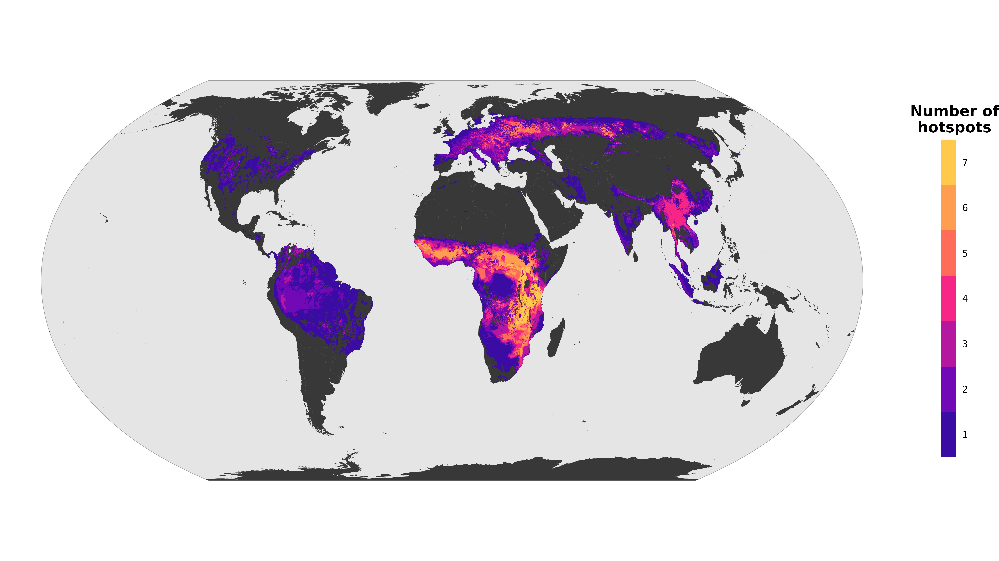

# Rethinking global hotspots of high-priority viral zoonoses to guide spillover risk monitoring

 

## Overview

This repository contains the R scripts used for predicting and mapping wild mammal hosts for WHO high-priority viral groups. The pipeline includes assembling the datasets, running the analyses, and mapping the hotspots and trends of exposure pressures.

### Target Viral Groups

The scripts iterate through the target viral groups. The abbreviations used across the file names and scripts are:

| Code | Viral Group |
| :--- | :--- |
| **`bcov`** | Betacoronavirus |
| **`hpv`** | Henipavirus |
| **`ebv`** | Ebolavirus & Marburgvirus |
| **`phv`** | Phlebovirus |
| **`ohv`** | Orthonairovirus |
| **`mmv`** | Mammarenavirus |
| **`flv`** | Flavivirus |

-----

## Repository Structure

### 1\. Spatial Overlaps & Pseudo-Negatives

  * **`1a_blueprint_pn_overlaps_ebv.R`** to **`1f_blueprint_pn_overlaps_phv.R`**
    Computes the spatial overlaps between known hosts and non-hosts based on species ranges. This step identifies "pseudo-negative" species for the machine learning pipeline.

### 2\. Dataset Assembly

  * **`2a_dataset_assem_ebv.R`** to **`2f_dataset_assem_phv.R`**
    Assembles the final datasets for each viral group. This includes computing specific instance weights for low-evidence and high-evidence hosts.

### 3\. Modelling Pipeline

  * **`3a_modelling_ebv.R`** to **`3f_modelling_phv.R`**
    These scripts run the hyperparameter tuning, model training, and validation of the ensemble models using a nested cross-validation. They ultimately output the predicted probabilities for both in-sample and out-of-sample mammal species.

### 4\. Host Richness Maps

  * **`4a_observedhotspots.R`**
    Maps the global richness of observed hosts.
  * **`4b_predictedhotspots.R`**
    Maps the global richness of observed and predicted hosts based on the model outputs.

### 5\. Figures

  * **`5_PredictedHostsFigures.R`**
    Reproduces the main text and supplementary figures *(Spatial maps are generated in their respective scripts).*

### 6\. Cumulative Hotspot Maps

  * **`6_cumulative_hotspots.R`**
    Aggregates the viral hazard maps and identifies the cumulative hotspots.

### 7\. Human Exposure Trends

  * **`7_population_deforestation_trends.R`**
    Extracts and analyzes population growth and deforestation rates within hotspot areas. Reproduces **Figure 4** .

-----

### Variable Dictionary

| Variable Name | Description | Source Dataset |
| :--- | :--- | :--- |
| `adult_mass_g` | Body mass | COMBINE |
| `max_longevity_d` | Longevity | COMBINE |
| `gestation_length_d` | Gestation length | COMBINE |
| `litter_size_n` | Litter size | COMBINE |
| `litters_per_year_n` | Litters per year | COMBINE |
| `interbirth_interval_d` | Interbirth interval | COMBINE |
| `weaning_age_d` | Weaning age | COMBINE |
| `trophic_level` | Trophic level | COMBINE |
| `area.1` | Log(Range size) | IUCN RedList |
| `mean.wc2.1_5m_bio_1` | Mean annual temp | WorldClim 2 |
| `mean.wc2.1_5m_bio_8` | Temp wettest quarter | WorldClim 2 |
| `mean.wc2.1_5m_bio_9` | Temp driest quarter | WorldClim 2 |
| `mean.wc2.1_5m_bio_10` | Temp warmest quarter | WorldClim 2 |
| `mean.wc2.1_5m_bio_11` | Temp coldest quarter | WorldClim 2 |
| `mean.wc2.1_5m_bio_12` | Annual prec | WorldClim 2 |
| `mean.wc2.1_5m_bio_16` | Prec wettest quarter | WorldClim 2 |
| `mean.wc2.1_5m_bio_17` | Prec driest quarter | WorldClim 2 |
| `mean.wc2.1_5m_bio_18` | Prec warmest quarter | WorldClim 2 |
| `mean.wc2.1_5m_bio_19` | Prec coldest quarter | WorldClim 2 |
| `stdev.wc2.1_5m_bio_1` | Mean annual temp variation | WorldClim 2 |
| `stdev.wc2.1_5m_bio_8` | Temp wettest quarter variation | WorldClim 2 |
| `stdev.wc2.1_5m_bio_9` | Temp driest quarter variation | WorldClim 2 |
| `stdev.wc2.1_5m_bio_10` | Temp warmest quarter variation | WorldClim 2 |
| `stdev.wc2.1_5m_bio_11` | Temp coldest quarter variation | WorldClim 2 |
| `stdev.wc2.1_5m_bio_12` | Annual prec quarter variation | WorldClim 2 |
| `stdev.wc2.1_5m_bio_16` | Prec wettest quarter variation | WorldClim 2 |
| `stdev.wc2.1_5m_bio_17` | Prec driest quarter variation | WorldClim 2 |
| `stdev.wc2.1_5m_bio_18` | Prec warmest quarter variation | WorldClim 2 |
| `stdev.wc2.1_5m_bio_19` | Prec coldest quarter variation | WorldClim 2 |
| `mean_divergence` | Phylo dist to mammals (mean) | PHYLACINE 1.2 |
| `mean_dist` | Phylo dist to hosts (mean) | PHYLACINE 1.2 |

---

### References

* **COMBINE (Life-history and trophic level):** Soria, C. D., Pacifici, M., Di Marco, M., Stephen, S. M. & Rondinini, C. COMBINE: a coalesced mammal database of intrinsic and extrinsic traits. *Ecology* 102, e03344 (2021).
* **IUCN RedList (Area):** IUCN RedList spatial data.
* **PHYLACINE 1.2 (Phylogeny):** Faurby, S. et al. PHYLACINE 1.2: The Phylogenetic Atlas of Mammal Macroecology. *Ecology* 99, 2626 (2018).
* **WorldClim 2 (Climatic variables):** Fick, S. E. & Hijmans, R. J. WorldClim 2: new 1-km spatial resolution climate surfaces for global land areas. *Int. J. Climatol.* 37, 4302–4315 (2017).

-----

## Software Requirements

R version and core packages

  * **R:** version `[4.4.2]`
  * **mlr3:** version `[1.3.0]` *(and the mlr3 ecosystem: mlr3tuning, mlr3learners)*
  * **tidyverse:** version `[2.0.0]`
  * **terra:** version `[1.8-86]`
